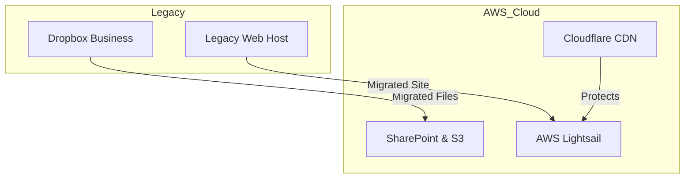

# IT Infrastructure Cost Optimization: 94% Reduction

A comprehensive migration project that reduced annual IT costs from $1,460 to $84 while improving security, compliance, and performance.

## 📊 Results Summary

| Metric | Before | After | Savings |
|--------|--------|--------|---------|
| **Annual Cost** | $1,460 | $84 | **$1,376 (94% reduction)** |
| **Monthly Dropbox** | $70 | $0 | $840/year |
| **Quarterly Hosting** | $155 | $21 (Lightsail) | $536/year |
| **Team Size** | 8 people | 8 people | No reduction in service |

## 🎯 The Challenge

Our 8-person medical billing company was facing:
- **High IT costs**: $1,463/year for basic file storage and website hosting
- **Compliance issues**: Shared Dropbox logins
- **Security risks**: No individual user accountability or audit trails
- **Limited scalability**: Expensive per-user costs as team grows

## 🚀 The Solution

### Three-pronged migration approach executed in a single day:

#### 1. File Storage Migration
- **From**: Dropbox Business ($70/month, shared logins)
- **To**: Microsoft SharePoint (existing M365 subscription)
- **Benefit**: Individual user accounts, better compliance, audit trails, no more redundant storage costs

#### 2. Website Hosting Migration  
- **From**: Traditional hosting ($155/quarter)
- **To**: AWS Lightsail ($7/month after 3-month free tier)
- **Benefit**: Better performance, integrated with AWS ecosystem, more control

#### 3. Data Archival Strategy
- **New**: AWS S3 Glacier Deep Archive for long-term PHI storage
- **Cost**: ~$0.18/month for 182GB
- **Benefit**: Region-redundant backup, HIPAA-compliant encryption



## 🛠️ Technical Implementation

### AWS S3 Deep Archive Setup
```bash
# Configure AWS CLI with named profile
aws configure --profile company-name

# Create encrypted bucket for PHI data
aws s3 mb s3://company-backup --region us-east-1 --profile company-name

# Enable server-side encryption
aws s3api put-bucket-encryption \
  --bucket company-backup \
  --server-side-encryption-configuration '{
    "Rules": [{
      "ApplyServerSideEncryptionByDefault": {
        "SSEAlgorithm": "AES256"
      }
    }]
  }' --profile company-name

# Block public access (critical for PHI)
aws s3api put-public-access-block \
  --bucket company-backup \
  --public-access-block-configuration \
  "BlockPublicAcls=true,IgnorePublicAcls=true,BlockPublicPolicy=true,RestrictPublicBuckets=true" \
  --profile company-name

# Upload to Deep Archive (lowest cost tier)
aws s3 cp "local-files/" s3://company-backup/ \
  --storage-class DEEP_ARCHIVE \
  --recursive \
  --profile company-name
```

### Lightsail WordPress Setup
- **Instance**: $7/month plan (1GB RAM, 2 vCPU, 40GB SSD)
- **CDN**: Integrated with Cloudflare's free tier (small business) for performance optimization
- **Backup**: ~$2/month per snapshot

### CloudFlare Configuration
- Updated nameservers to point to CloudFlare
- Enabled orange cloud proxy for CDN benefits
- Reduced Lightsail bandwidth usage (cost protection)

## 📈 Key Metrics & Outcomes

### Cost Analysis
- **Immediate savings**: $70/month + $52/month = $1,376/year
- **Implementation cost**: ~$4.32 (AWS PUT requests for 86,419 files)
- **Ongoing costs**: $170/year total infrastructure
- **Payback period**: Immediate (saves money from month 1)

### Performance Improvements
- **Website**: Better performance with Lightsail + CloudFlare CDN
- **File access**: SharePoint collaboration features vs basic file storage
- **Backup**: S3 storage glacier deep archive

### Compliance & Security Gains
- **Individual user accounts**: Eliminated shared login security risk
- **Audit trails**: Full tracking of file access and modifications
- **PHI compliance**: Encrypted S3 storage with proper access controls
- **Redundancy**: Multiple backup locations (SharePoint + S3)

## 🔧 Tools & Technologies Used

- **AWS CLI**: Infrastructure automation and S3 management
- **AWS Lightsail**: WordPress hosting platform
- **AWS S3 Glacier Deep Archive**: Long-term data archival
- **Microsoft SharePoint**: Active collaboration and file storage
- **CloudFlare**: CDN and DNS management
- **Windows File System**: Local data organization pre-migration

## 📚 Lessons Learned

### What Worked Well
1. **Batched approach**: Tackling all three migrations together prevented duplicate work
2. **CloudFlare integration**: Significant bandwidth cost protection for Lightsail
3. **Storage class optimization**: Deep Archive perfect for "set and forget" data
4. **Compliance-first thinking**: Individual accounts eliminated multiple security risks

### Optimization Opportunities
- **File compression**: Could have reduced S3 costs further with 7zip archives
- **Lifecycle policies**: Automated transitions between S3 storage classes
- **Monitoring setup**: CloudWatch alerts for cost thresholds

### Gotchas to Avoid
- **Request costs**: 86K+ individual files = $4.32 in PUT requests (vs pennies for zipped archives, but then less granular control on retrievals if necessary)
- **Early deletion fees**: S3 Deep Archive has 180-day minimum storage commitment
- **Lightsail bandwidth**: Monitor usage to avoid overage charges (mitigated by CloudFlare)

## 💡 Replication Guide

### Prerequisites
- AWS account with proper IAM permissions
- Microsoft 365 subscription (for SharePoint)
- CloudFlare account (free tier sufficient)
- Domain name with changeable nameservers

### Step-by-Step Process
1. **Plan the migration**: Inventory current services and costs
2. **Set up AWS infrastructure**: Lightsail instance, S3 bucket with encryption
3. **Configure CloudFlare**: Update nameservers, enable proxy
4. **Migrate website**: Transfer files, update DNS, test functionality
5. **SharePoint setup**: Create team site, configure permissions
6. **Data migration**: Transfer files from old storage to SharePoint
7. **Archive creation**: Upload historical data to S3 Deep Archive
8. **Testing phase**: Verify all services work correctly
9. **Cancel old services**: Once confident in new setup (and no files are missing or inaccessible)

## 🎉 Impact

This one-day project delivered:
- **$1,376 annual savings** 
- **Improved security posture** for medical billing company
- **Better compliance** with PHI handling requirements
- **Enhanced performance** through modern cloud infrastructure

---

*Project completed in Q3 2025 for an 8-person medical billing company. All costs and savings calculated based on actual usage and billing.*
